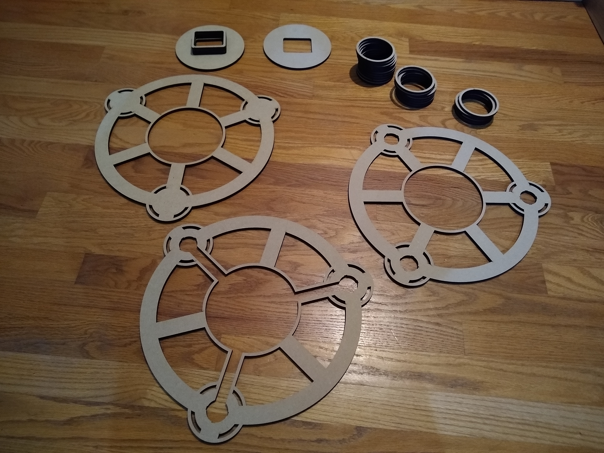
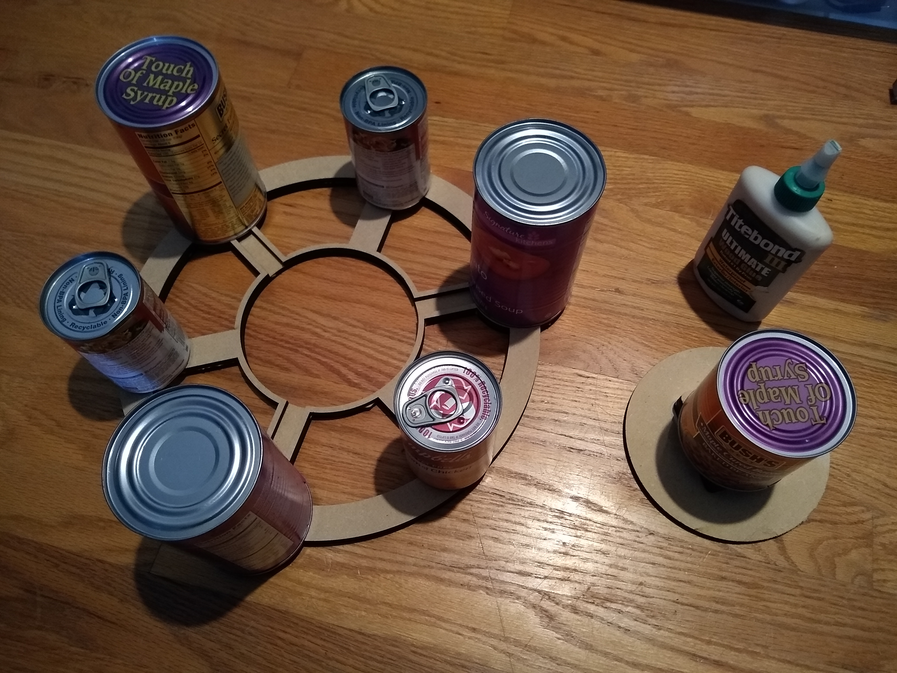
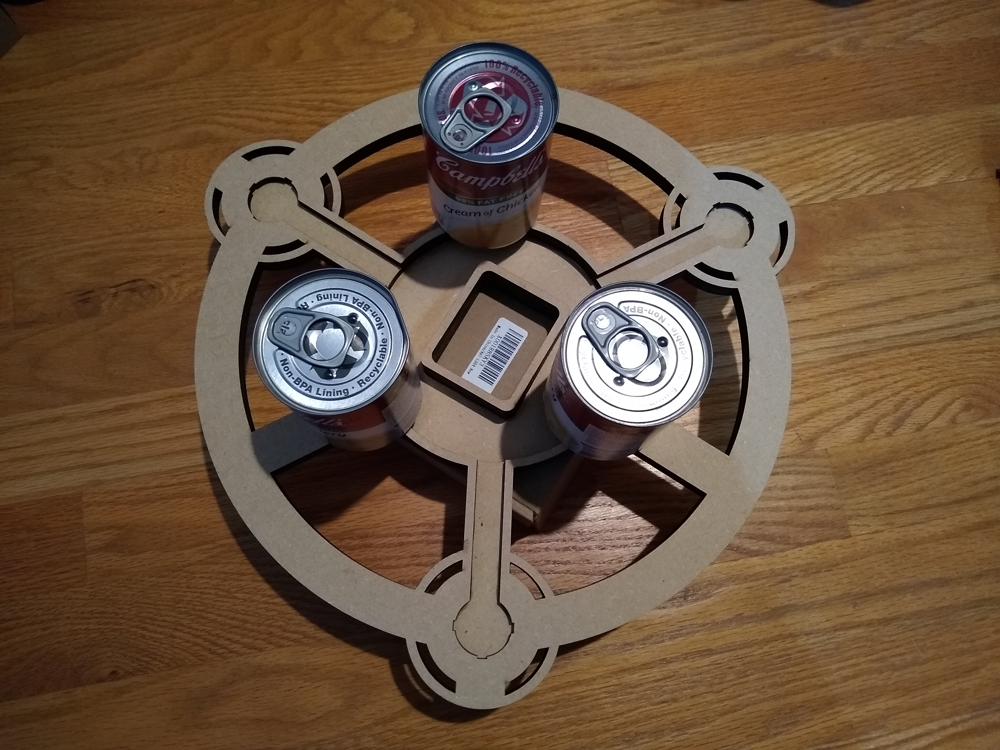
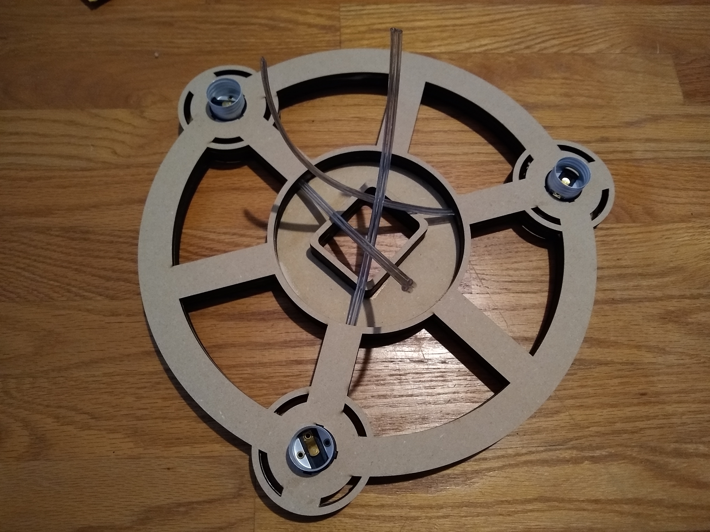
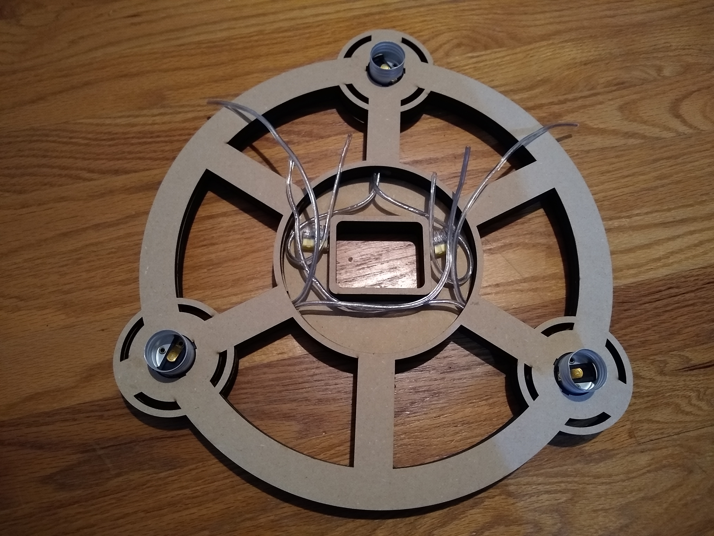
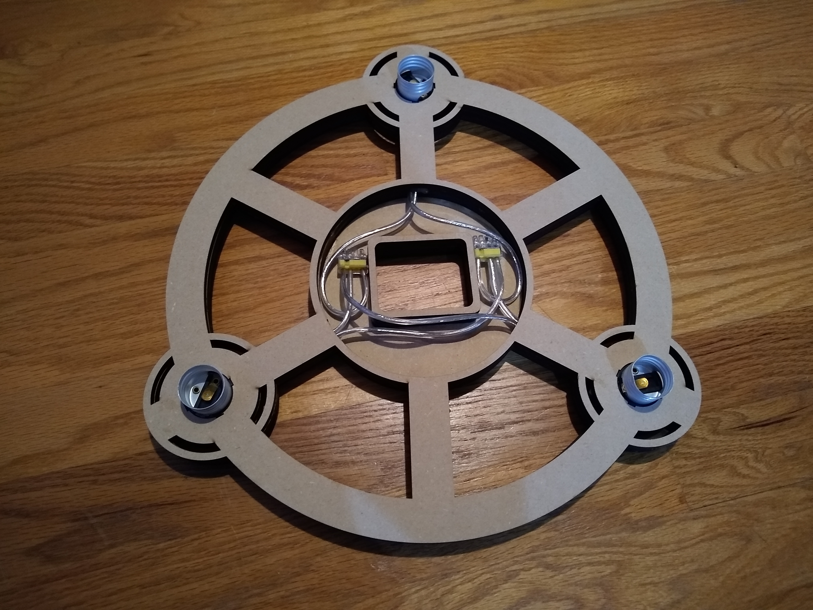
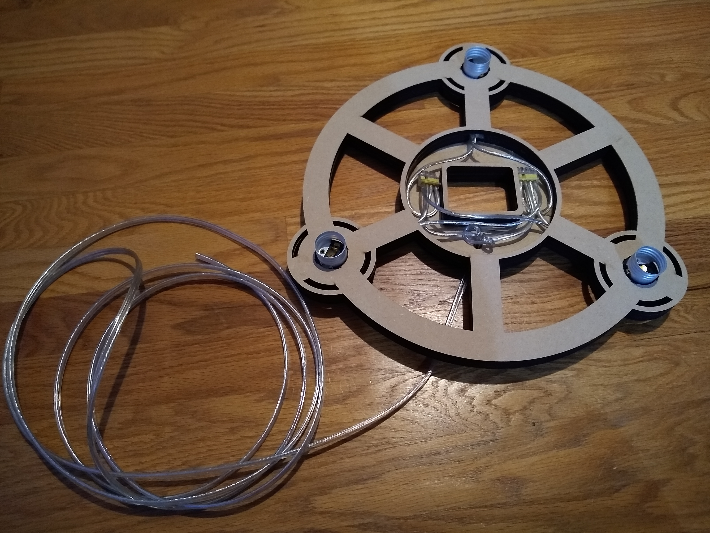
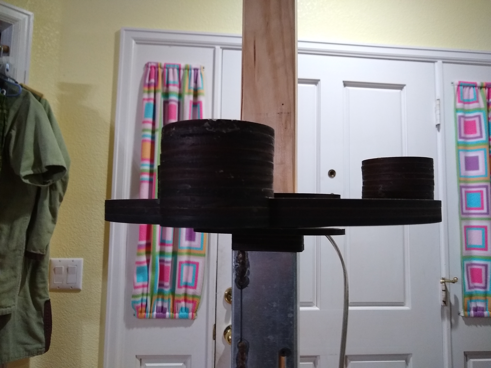
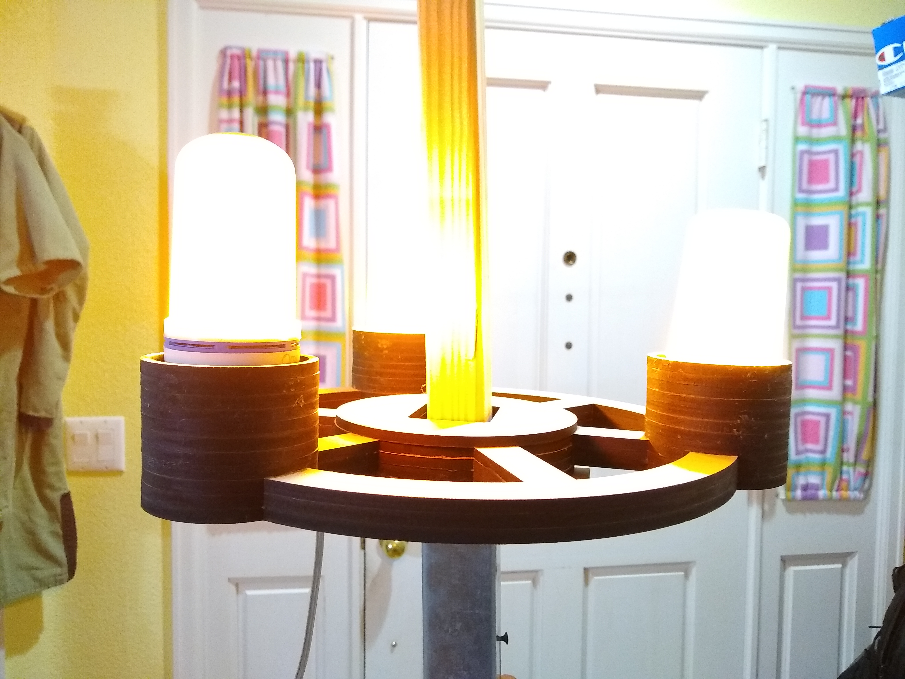
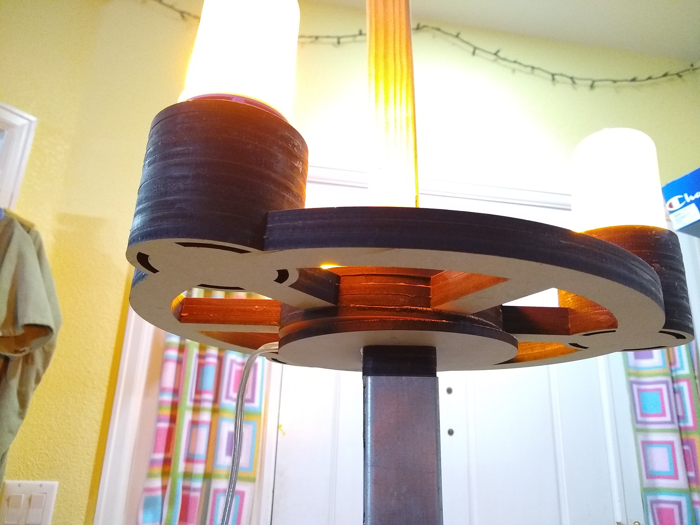

# Cartwheel Lamp

More lighting for medieval atmosphere at feast and other events!

This is v1 of the cartwheel lamp version that slides over a center pole, such
as a tent pole. I designed/made this after `../center-pvc-stand-v2/` and
`../wood-overhead-stand-v1/`.

# Bill of Materials

The following materials are required:

| Quantity | Pack Quantity | Pack Cost | Lamp Cost | Description | Link | 
| -------- | ------------- | --------- | ---------- | ----------- | ---- |
| 3 | 1 | 1.94 | 5.82 | MDF wood, 2ft x 2ft x 1/4in | [Home Depot](https://www.homedepot.com/p/1-4-in-x-2-ft-x-2-ft-Medium-Density-Fiber-Board-1508102/205881910) |
| 3 | 9 | 9.99 | 3.33 | Ruisita lampholders | [Amazon](https://smile.amazon.com/gp/product/B07PMJ48TX/ref=ppx_yo_dt_b_asin_title_o03_s00?ie=UTF8&psc=1) |
| 3 | 1 | 14.95 | 44.85 | LED flame lamp, option 1 (recommended) | [Amazon](https://smile.amazon.com/gp/product/B07PXM7K2D/ref=ppx_yo_dt_b_asin_title_o00_s01?ie=UTF8&psc=1) |
| 3 | 2 | 15.95 | 23.95 | LED flame lamp, option 2 | [Amazon](https://smile.amazon.com/gp/product/B0791BWFCL/ref=ppx_yo_dt_b_asin_title_o00_s01?ie=UTF8&psc=1) |
| 3 | 4 | 35.99 | 26.99 | LED flame lamp, option 3 (recommended) | [Amazon](https://smile.amazon.com/gp/product/B07VHZ4M2Y/ref=ppx_yo_dt_b_asin_title_o01_s00?ie=UTF8&psc=1) |
| 3 | 4 | 32.99 | 24.74 | LED flame lamp, option 4 | [Amazon](https://smile.amazon.com/gp/product/B07PSFXNC3/ref=ppx_yo_dt_b_asin_title_o01_s01?ie=UTF8&psc=1) |
| 2 | 100 | 8.37 | 0.17 | Push-in 4-way wire nuts | [Home Depot](https://www.homedepot.com/p/Ideal-34-Yellow-In-Sure-4-Port-Connector-100-Pack-30-1034P/202894312) |
| 15 | 250 | 45.00 | 2.70 | 18/2 SPT-2 lamp wire | [Home Dept](https://www.homedepot.com/p/Southwire-250-ft-18-2-Silver-Stranded-CU-SPT-1-Lamp-Wire-56176344/202316595) |
| 1 | 1 | 1.99 | 1.99 | Electrical plug | [Home Depot](https://www.homedepot.com/p/Leviton-15-Amp-125-Volt-2-Pole-2-Wire-Polarized-Plug-White-R62-00101-0WH/302183191) |

Total cost: ~$14.01 plus lamps, i.e ~$45.

# Instructions

1. LASER-cut the wood according to layouts in `*.lbrn` or `*.svg`. The files in
`inkscape/` were manually drawn in Inkscape. The files in `openscad/` were
generated using OpenSCAD, and hence are easier/quicker to modify for design
changes, such as slight size adjustments.

2. Glue layer 1 (bottom) and layer 2 (center) of the wood together.

3. Glue all layers of the rectangular pole rings onto the bottom center hub
layer. Glue these onto the bottom of layer 1. Ensure the pole rings are
oriented as desired for wire routing inside the hub.

4. Measure wire from lampholder slots in wood layer 2 to center of cartwheel,
with some slack. Cut wire to this length (3 pieces).

5. Open the lampholders, discard the outer plastic shell. Only the inner
mostly-metal part will be used.

6. Attach cut wire to lampholders. Place lampholders in slots in wood layer 2.
Join wires in center of cartwheel using push-fit wire nuts. Ensure that the
center terminal of all 3 lampholders are joined to the same wire nut. You may
want to hot-glue the wire to keep it snug inside the slot in layer 2. You may
want to hot-glue the lampholders in place; if you do, be careful to ensure
they're as vertical as possible.

7. Glue layer 3 (top) of the wood on top of layers 1 and 2.

8. Drill a hole in the bottom hub layer to allow the main lamp wire to enter.
Push the wire through it, tie an underwriter's knot inside the hub, and connect
the main wire into the wire nuts.

9. Cut the main lamp wire to length, e.g. 7' to 12' hanging out of the hub.
Wire it into the plug. Make sure the hot pin is wired to the tips of the
lampholders, not the outer cans! Test the lamp.

10. Glue the top center hub layer to the top of layer 3 to seal the center hub.
Make sure the center pole rings align with the hole in the hub. This is the
point of no return for wiring!

11. If you didn't hot-glue the lampholders before, place hot-glue around the
outside of each lampholder, where it emerges from the wood layer, to ensure
they're straight. This may be easiest with a lamp in the lampholder that can be
used to vertically align (and hold in place) the lampholder while gluing.

12. Place a number of layers of wood around each lampholder, using the small
circular ring pieces. I typically add a total of 8 layers of these rings,
although the best number will depend on the design of your bulbs and how much
plastic you want to hide.

The lamp should now slide over whichever pole you will use to mount it. You'll
probably want to drill a small hole through the pole, and fill it with a dowel
or very stiff wire to support the cartwheel. To maintain a flat mounting angle,
you may want to build the support piece and stack the cartwheel on top of it.
With this option, you'll want to manually carve out a hole for the wire to
escape so that the cartwheel sits flat. I forgot about this, so haven't done it
in the pictures below.

